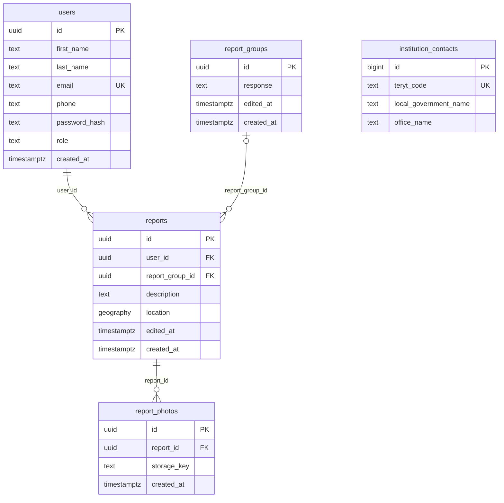

# Model danych

Źródło: `db/migrations/01_createCoreTables.sql`, `db/migrations/02_createGeoTables.sql`.

## ERD

`institution_contacts` nie ma relacji z pozostałymi tabelami. Na diagramie pokazano tylko wybrane kolumny, pełna lista jest niżej.

## Tabele

### users

| Kolumna | Typ | Ograniczenia |
| --- | --- | --- |
| id | uuid | PK, domyślnie `gen_random_uuid()` |
| first_name | text | NOT NULL |
| last_name | text | NOT NULL |
| email | text | NOT NULL, UNIQUE |
| phone | text | NULL |
| password_hash | text | NOT NULL, nigdy nie zwracany w API |
| role | text | NOT NULL, domyślnie `'user'`, CHECK: `user`, `office` lub `admin` |
| created_at | timestamptz | NOT NULL, domyślnie `NOW()` |

### report_groups

| Kolumna | Typ | Ograniczenia |
| --- | --- | --- |
| id | uuid | PK |
| response | text | NULL, wspólna odpowiedź na zgłoszenia o tym samym problemie |
| edited_at | timestamptz | NOT NULL, ustawiane triggerem przy UPDATE |
| created_at | timestamptz | NOT NULL |

### reports

| Kolumna | Typ | Ograniczenia |
| --- | --- | --- |
| id | uuid | PK |
| user_id | uuid | NOT NULL, FK -> users(id), bez akcji przy usuwaniu |
| report_group_id | uuid | NULL, FK -> report_groups(id), ON DELETE SET NULL |
| description | text | NOT NULL, niepusty po przycięciu spacji |
| location | geography(point, 4326) | NOT NULL, niepusty punkt, kolejność: długość, szerokość (lng, lat) |
| edited_at | timestamptz | NOT NULL, trigger |
| created_at | timestamptz | NOT NULL |

Indeksy: `user_id`, `report_group_id`, GIST na `location`.

### report_photos

| Kolumna | Typ | Ograniczenia |
| --- | --- | --- |
| id | uuid | PK |
| report_id | uuid | NOT NULL, FK -> reports(id), ON DELETE CASCADE |
| storage_key | text | NOT NULL, niepusty, trwały klucz pliku lub obiektu (nie wygasający URL) |
| created_at | timestamptz | NOT NULL |

Ograniczenie: UNIQUE (report_id, storage_key).

### institution_contacts

Katalog urzędów importowany z `db/seeds/teleaddr_base_16042026.xls`. Dane referencyjne, API tylko je czyta.

| Kolumna | Typ | Uwagi |
| --- | --- | --- |
| id | bigint | PK, BIGSERIAL (jedyna tabela bez UUID) |
| teryt_code | text | NOT NULL, UNIQUE, dokładnie 7 cyfr |
| local_government_name | text | NOT NULL, niepusty |
| province, county | text | NULL |
| local_government_type | text | NULL, GW, GM, GMW, P, MNP, W |
| office_name | text | NULL |
| locality, postal_code, post_office, street, house_number | text | NULL, adres pocztowy |
| phone_area_code, phone_number, alternate_phone_number, phone_extension | text | NULL |
| fax_area_code, fax_number, fax_extension | text | NULL |
| email, website | text | NULL |
| electronic_inbox | text | NULL, skrzynka ePUAP (ESP) |
| electronic_delivery_address | text | NULL, adres do doręczeń elektronicznych (ADE) |

## Reguły usuwania

| Usuwany rekord | Skutek |
| --- | --- |
| users | błąd, jeśli istnieją jego `reports` (brak ON DELETE) |
| report_groups | `reports.report_group_id` ustawiane na NULL |
| reports | zdjęcia usuwane kaskadowo |
| report_photos | brak zależności |

Usuwanie jest fizyczne. Tabele nie mają `deleted_at`.
