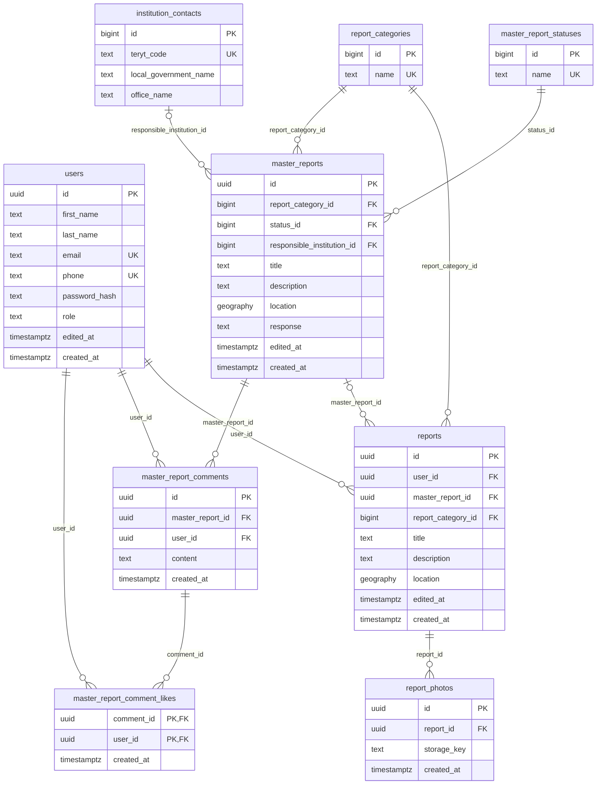

# Model danych

Źródło: migracje w `db/migrations/`. Migracje 01 i 02 tworzą tabele, 03 dodaje ograniczenia, a 04 wstawia początkowe kategorie i statusy.

## ERD

Na diagramie pokazano tylko wybrane kolumny `institution_contacts`, pełna lista jest niżej.

Pojedynczy report jest zapisywany przed klasyfikacją, więc może nie mieć mastera. Backend po klasyfikacji tworzy master na podstawie pierwszego reportu albo przypina report do istniejącego mastera. Treść mastera jest niezależna; wspólny status, odpowiedź, odpowiedzialna jednostka, komentarze i polubienia należą do mastera.

## Tabele

### users

| Kolumna | Typ | Ograniczenia |
| --- | --- | --- |
| id | uuid | PK, domyślnie `gen_random_uuid()` |
| first_name | text | NOT NULL |
| last_name | text | NOT NULL |
| email | text | NULL, UNIQUE |
| phone | text | NULL, UNIQUE |
| password_hash | text | NOT NULL, nigdy nie zwracany w API |
| role | text | NOT NULL, domyślnie `'user'`, CHECK: `user`, `office` lub `admin` |
| edited_at | timestamptz | NOT NULL, domyślnie `NOW()`, ustawiane triggerem przy UPDATE |
| created_at | timestamptz | NOT NULL, domyślnie `NOW()` |

Ograniczenie: co najmniej jedno z pól `email` lub `phone` musi być niepuste po przycięciu spacji.

### report_categories

| Kolumna | Typ | Ograniczenia |
| --- | --- | --- |
| id | bigint | PK, BIGSERIAL |
| name | text | NOT NULL, UNIQUE, niepusty po przycięciu spacji |

Migracja 04 wstawia `improvement` i `issue`. Backend wyszukuje ID po nazwie, bez zakładania konkretnych wartości liczbowych.

### master_report_statuses

| Kolumna | Typ | Ograniczenia |
| --- | --- | --- |
| id | bigint | PK, BIGSERIAL |
| name | text | NOT NULL, UNIQUE, niepusty po przycięciu spacji |

Migracja 04 wstawia:

| Status | Znaczenie |
| --- | --- |
| created | master zapisany w aplikacji |
| reported | zgłoszenie skutecznie przekazane odpowiedzialnej jednostce |
| inprogress | potwierdzone rozpoczęcie prac |
| finished | potwierdzone zakończenie |

Backend ustawia status i obsługuje przejścia między statusami. Baza nie nadaje domyślnego statusu.

### master_reports

| Kolumna | Typ | Ograniczenia |
| --- | --- | --- |
| id | uuid | PK |
| report_category_id | bigint | NOT NULL, FK -> report_categories(id) |
| status_id | bigint | NOT NULL, FK -> master_report_statuses(id) |
| responsible_institution_id | bigint | NULL, FK -> institution_contacts(id), przypisywany przez klasyfikator |
| title | text | NOT NULL, niepusty po przycięciu spacji |
| description | text | NOT NULL, niepusty po przycięciu spacji |
| location | geography(point, 4326) | NOT NULL, niepusty punkt WGS 84 (lng, lat) |
| response | text | NULL, wspólna odpowiedź na zgłoszenia o tym samym problemie |
| edited_at | timestamptz | NOT NULL, ustawiane triggerem przy UPDATE |
| created_at | timestamptz | NOT NULL |

Indeksy: `report_category_id`, `status_id`, `responsible_institution_id`, GIST na `location`.

### reports

| Kolumna | Typ | Ograniczenia |
| --- | --- | --- |
| id | uuid | PK |
| user_id | uuid | NOT NULL, FK -> users(id), bez akcji przy usuwaniu |
| master_report_id | uuid | NULL do klasyfikacji, FK -> master_reports(id), ON DELETE RESTRICT |
| report_category_id | bigint | NOT NULL, FK -> report_categories(id) |
| title | text | NOT NULL, niepusty po przycięciu spacji |
| description | text | NOT NULL, niepusty po przycięciu spacji |
| location | geography(point, 4326) | NOT NULL, niepusty punkt, kolejność: długość, szerokość (lng, lat) |
| edited_at | timestamptz | NOT NULL, trigger |
| created_at | timestamptz | NOT NULL |

Indeksy: `user_id`, `master_report_id`, `report_category_id`, GIST na `location`.

### report_photos

| Kolumna | Typ | Ograniczenia |
| --- | --- | --- |
| id | uuid | PK |
| report_id | uuid | NOT NULL, FK -> reports(id), ON DELETE CASCADE |
| storage_key | text | NOT NULL, niepusty, trwały klucz pliku lub obiektu (nie wygasający URL) |
| created_at | timestamptz | NOT NULL |

Ograniczenie: UNIQUE (report_id, storage_key).

### master_report_comments

| Kolumna | Typ | Ograniczenia |
| --- | --- | --- |
| id | uuid | PK |
| master_report_id | uuid | NOT NULL, FK -> master_reports(id), ON DELETE CASCADE |
| user_id | uuid | NOT NULL, FK -> users(id), bez akcji przy usuwaniu |
| content | text | NOT NULL, niepusty po przycięciu spacji |
| created_at | timestamptz | NOT NULL |

Indeksy: `(master_report_id, created_at, id)` do odczytu komentarzy w kolejności oraz `user_id`.

### master_report_comment_likes

| Kolumna | Typ | Ograniczenia |
| --- | --- | --- |
| comment_id | uuid | PK (część), FK -> master_report_comments(id), ON DELETE CASCADE |
| user_id | uuid | PK (część), FK -> users(id), ON DELETE CASCADE |
| created_at | timestamptz | NOT NULL |

Klucz główny `(comment_id, user_id)` pozwala użytkownikowi polubić komentarz tylko raz. Indeks: `user_id`. Liczba polubień jest wyliczana z wierszy tej tabeli.

### institution_contacts

Katalog urzędów importowany z `db/seeds/teleaddr_base_16042026.xls`. Dane referencyjne, API tylko je czyta.

| Kolumna | Typ | Uwagi |
| --- | --- | --- |
| id | bigint | PK, BIGSERIAL |
| teryt_code | text | NOT NULL, UNIQUE, dokładnie 7 cyfr |
| local_government_name | text | NOT NULL, niepusty |
| province, county | text | NULL |
| local_government_type | text | NULL, GW, GM, GMW, P, MNP, W |
| office_name | text | NULL |
| locality, postal_code, post_office, street, house_number | text | NULL, adres pocztowy |
| phone_area_code, phone_number, alternate_phone_number, phone_extension | text | NULL |
| fax_area_code, fax_number, fax_extension | text | NULL |
| email, website | text | NULL |
| electronic_inbox | text | NULL, skrzynka ePUAP (ESP) |
| electronic_delivery_address | text | NULL, adres do doręczeń elektronicznych (ADE) |

## Reguły usuwania

| Usuwany rekord | Skutek |
| --- | --- |
| users | błąd, jeśli istnieją jego reporty lub komentarze; polubienia usuwane kaskadowo |
| master_reports | błąd, jeśli istnieją powiązane reporty; w pozostałych przypadkach komentarze i polubienia usuwane kaskadowo |
| reports | zdjęcia usuwane kaskadowo; master i dyskusja pozostają |
| report_photos | brak zależności |
| master_report_comments | polubienia usuwane kaskadowo |
| master_report_comment_likes | brak zależności |
| report_categories, master_report_statuses, institution_contacts | błąd, jeśli rekord jest referencjonowany |

Usuwanie jest fizyczne. Tabele nie mają `deleted_at`.
