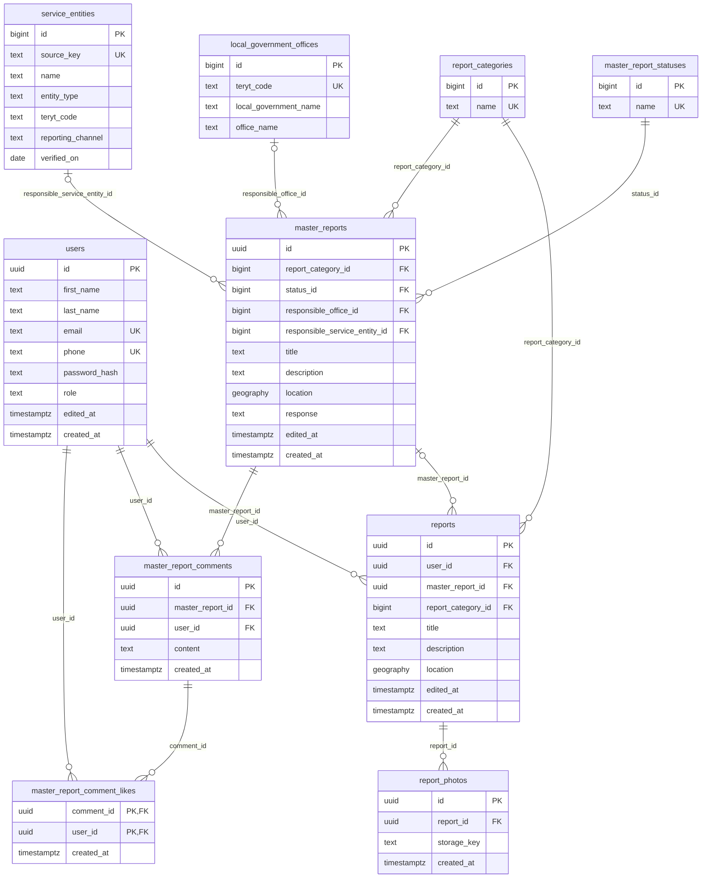

# Model danych

Źródło: migracje w `db/migrations/`. Migracje 01 i 02 tworzą tabele, 03 dodaje ograniczenia, a 04 wstawia początkowe kategorie i statusy.

## ERD

Na diagramie pokazano tylko wybrane kolumny `local_government_offices` i `service_entities`, pełne listy są niżej.

Pojedynczy report jest zapisywany przed klasyfikacją, więc może nie mieć mastera. Backend po klasyfikacji tworzy master na podstawie pierwszego reportu albo przypina report do istniejącego mastera. Treść mastera jest niezależna; wspólny status, odpowiedź, odpowiedzialna jednostka, komentarze i polubienia należą do mastera.

## Tabele

### users

| Kolumna | Typ | Ograniczenia |
| --- | --- | --- |
| id | uuid | PK, domyślnie `gen_random_uuid()` |
| first_name | text | NOT NULL |
| last_name | text | NOT NULL |
| email | text | NULL, UNIQUE |
| phone | text | NULL, UNIQUE |
| password_hash | text | NOT NULL, nigdy nie zwracany w API |
| role | text | NOT NULL, domyślnie `'user'`, CHECK: `user`, `office` lub `admin` |
| edited_at | timestamptz | NOT NULL, domyślnie `NOW()`, ustawiane triggerem przy UPDATE |
| created_at | timestamptz | NOT NULL, domyślnie `NOW()` |

Ograniczenie: co najmniej jedno z pól `email` lub `phone` musi być niepuste po przycięciu spacji.

### report_categories

| Kolumna | Typ | Ograniczenia |
| --- | --- | --- |
| id | bigint | PK, BIGSERIAL |
| name | text | NOT NULL, UNIQUE, niepusty po przycięciu spacji |

Migracja 04 wstawia `improvement` i `issue`. Backend wyszukuje ID po nazwie, bez zakładania konkretnych wartości liczbowych.

### master_report_statuses

| Kolumna | Typ | Ograniczenia |
| --- | --- | --- |
| id | bigint | PK, BIGSERIAL |
| name | text | NOT NULL, UNIQUE, niepusty po przycięciu spacji |

Migracja 04 wstawia:

| Status | Znaczenie |
| --- | --- |
| created | master zapisany w aplikacji |
| reported | zgłoszenie skutecznie przekazane odpowiedzialnej jednostce |
| inprogress | potwierdzone rozpoczęcie prac |
| finished | potwierdzone zakończenie |

Backend ustawia status i obsługuje przejścia między statusami. Baza nie nadaje domyślnego statusu.

### master_reports

| Kolumna | Typ | Ograniczenia |
| --- | --- | --- |
| id | uuid | PK |
| report_category_id | bigint | NOT NULL, FK -> report_categories(id) |
| status_id | bigint | NOT NULL, FK -> master_report_statuses(id) |
| responsible_office_id | bigint | NULL, FK -> local_government_offices(id), ON DELETE RESTRICT |
| responsible_service_entity_id | bigint | NULL, FK -> service_entities(id), ON DELETE RESTRICT |
| title | text | NOT NULL, niepusty po przycięciu spacji |
| description | text | NOT NULL, niepusty po przycięciu spacji |
| location | geography(point, 4326) | NOT NULL, niepusty punkt WGS 84 (lng, lat) |
| response | text | NULL, wspólna odpowiedź na zgłoszenia o tym samym problemie |
| edited_at | timestamptz | NOT NULL, ustawiane triggerem przy UPDATE |
| created_at | timestamptz | NOT NULL |

Master może wskazywać urząd albo jednostkę usługową. Ograniczenie CHECK dopuszcza najwyżej
jedno przypisanie; oba pola NULL oznaczają brak przypisania. Klucze obce sprawdzają istnienie
odpowiedzialnego podmiotu i blokują jego usunięcie. Zmiana odbiorcy wymaga ustawienia obu
pól w jednym UPDATE. Sam routing nie jest jeszcze zaimplementowany.

Indeksy: `report_category_id`, `status_id`, `responsible_office_id`, `responsible_service_entity_id`, GIST na `location`.

### reports

| Kolumna | Typ | Ograniczenia |
| --- | --- | --- |
| id | uuid | PK |
| user_id | uuid | NOT NULL, FK -> users(id), bez akcji przy usuwaniu |
| master_report_id | uuid | NULL do klasyfikacji, FK -> master_reports(id), ON DELETE RESTRICT |
| report_category_id | bigint | NOT NULL, FK -> report_categories(id) |
| title | text | NOT NULL, niepusty po przycięciu spacji |
| description | text | NOT NULL, niepusty po przycięciu spacji |
| location | geography(point, 4326) | NOT NULL, niepusty punkt, kolejność: długość, szerokość (lng, lat) |
| edited_at | timestamptz | NOT NULL, trigger |
| created_at | timestamptz | NOT NULL |

Indeksy: `user_id`, `master_report_id`, `report_category_id`, GIST na `location`.

### report_photos

| Kolumna | Typ | Ograniczenia |
| --- | --- | --- |
| id | uuid | PK |
| report_id | uuid | NOT NULL, FK -> reports(id), ON DELETE CASCADE |
| storage_key | text | NOT NULL, niepusty, trwały klucz pliku lub obiektu (nie wygasający URL) |
| created_at | timestamptz | NOT NULL |

Ograniczenie: UNIQUE (report_id, storage_key).

### master_report_comments

| Kolumna | Typ | Ograniczenia |
| --- | --- | --- |
| id | uuid | PK |
| master_report_id | uuid | NOT NULL, FK -> master_reports(id), ON DELETE CASCADE |
| user_id | uuid | NOT NULL, FK -> users(id), bez akcji przy usuwaniu |
| content | text | NOT NULL, niepusty po przycięciu spacji |
| created_at | timestamptz | NOT NULL |

Indeksy: `(master_report_id, created_at, id)` do odczytu komentarzy w kolejności oraz `user_id`.

### master_report_comment_likes

| Kolumna | Typ | Ograniczenia |
| --- | --- | --- |
| comment_id | uuid | PK (część), FK -> master_report_comments(id), ON DELETE CASCADE |
| user_id | uuid | PK (część), FK -> users(id), ON DELETE CASCADE |
| created_at | timestamptz | NOT NULL |

Klucz główny `(comment_id, user_id)` pozwala użytkownikowi polubić komentarz tylko raz. Indeks: `user_id`. Liczba polubień jest wyliczana z wierszy tej tabeli.

### local_government_offices

Katalog urzędów importowany z `db/seeds/teleaddr_base_16042026.xls`. Dane referencyjne, API tylko je czyta.

| Kolumna | Typ | Uwagi |
| --- | --- | --- |
| id | bigint | PK, BIGSERIAL |
| teryt_code | text | NOT NULL, UNIQUE, dokładnie 7 cyfr |
| local_government_name | text | NOT NULL, niepusty |
| province, county | text | NULL |
| local_government_type | text | NULL, GW, GM, GMW, P, MNP, W |
| office_name | text | NULL |
| locality, postal_code, post_office, street, house_number | text | NULL, adres pocztowy |
| phone_area_code, phone_number, alternate_phone_number, phone_extension | text | NULL |
| email, website | text | NULL |
| electronic_inbox | text | NULL, skrzynka ePUAP (ESP) |
| electronic_delivery_address | text | NULL, adres do doręczeń elektronicznych (ADE) |

Usunięto wyłącznie `fax_area_code`, `fax_number` i `fax_extension`: aplikacja nie obsługuje
faksu, a pola nie miały odbiorców poza importerem, testami i dokumentacją. Pozostałe pola
zachowano po sprawdzeniu 203 wierszy źródła MSWiA, w tym telefony alternatywne, numery
wewnętrzne, pocztę (może różnić się od miejscowości), ePUAP i ADE. Importer nadal sprawdza
wszystkie 22 nagłówki XLS, lecz zapisuje 19 pól danych.

### service_entities

Katalog wyspecjalizowanych jednostek przyjmujących sprawy miejskie. Migracja 02 tworzy
jedną tabelę; nie ma osobnych tabel kontaktów, kompetencji ani jurysdykcji.

| Kolumna | Typ | Uwagi |
| --- | --- | --- |
| id | bigint | PK, BIGSERIAL |
| source_key | text | NOT NULL, UNIQUE, niepusty; stabilny klucz importu, np. `bip:129155` |
| name | text | NOT NULL, niepusty; nazwa jednostki |
| short_name | text | NULL, skrót lub krótka nazwa |
| entity_type | text | NOT NULL, typ z listy poniżej |
| teryt_code | text | NULL lub dokładnie 7 cyfr; powiązana gmina, bez FK i bez definicji zasięgu usług |
| locality, postal_code, street, house_number | text | NULL, adres siedziby lub oddziału |
| phone_number, email | text | NULL, kontakt ogólny |
| website, bip_url | text | NULL, oficjalna strona i BIP |
| reporting_channel | text | NULL, URL formularza albo URI `tel:` / `mailto:` |
| reporting_channel_description | text | NULL, przeznaczenie kanału, ewentualne godziny i ograniczenia |
| source_urls | text[] | NOT NULL, niepusta lista oficjalnych źródeł, bez elementów NULL |
| verified_on | date | NOT NULL, data odczytu źródła; dla uzupełnień najstarsza data odczytu użytych danych |

Brakujące dane adresowe i kontaktowe, TERYT, kanał zgłoszeniowy lub jego opis pozostają NULL.
Sam kontakt do sekretariatu nie jest automatycznie uznawany za dedykowany kanał interwencyjny. Krótkie numery, np. 986,
są lokalne; nie stanowią jednoznacznego adresata do automatycznej wysyłki.

| entity_type | Znaczenie |
| --- | --- |
| road_manager | zarządca dróg, w tym powiatowych lub wojewódzkich |
| transport_authority | organizator transportu, np. ZTP |
| transport_operator | operator przewozów, np. MPK lub Mobilis |
| green_space_manager | zarządca zieleni |
| water_infrastructure_manager | zarządca infrastruktury wodnej i odwodnienia, np. ZIW |
| water_sewage_utility | przedsiębiorstwo wodociągowo-kanalizacyjne |
| water_sewage_authority | związek JST ds. wodociągów i kanalizacji |
| heating_utility | przedsiębiorstwo ciepłownicze |
| waste_management | oczyszczanie, odpady i składowiska |
| municipal_services | zakład lub przedsiębiorstwo komunalne o szerszym zakresie |
| municipal_guard | straż miejska lub gminna |
| housing_manager | zarządca budynków, zasobów lub mienia komunalnego |
| cemetery_manager | zarządca cmentarzy |
| sports_infrastructure_manager | zarządca infrastruktury sportowej |
| municipal_investment | jednostka inwestycji miejskich |

Typ to kategoria katalogu, nie komplet kompetencji. ZTP pozostaje organizatorem, a MPK
i Mobilis operatorami; nie przypisujemy operatorom odpowiedzialności za przystanki.
TERYT z centralnego BIP opisuje powiązaną lokalizację i nie wyznacza jurysdykcji.
Przykładowo ZDW ma siedzibę w Krakowie, ale nie jest jednostką odpowiedzialną wyłącznie
za miasto. Brak potwierdzonego kodu pozostaje NULL; nie zgadujemy go z nazwy lub adresu.

Indeksy: `teryt_code`, `entity_type`.

## Reguły usuwania

| Usuwany rekord | Skutek |
| --- | --- |
| users | błąd, jeśli istnieją jego reporty lub komentarze; polubienia usuwane kaskadowo |
| master_reports | błąd, jeśli istnieją powiązane reporty; w pozostałych przypadkach komentarze i polubienia usuwane kaskadowo |
| reports | zdjęcia usuwane kaskadowo; master i dyskusja pozostają |
| report_photos | brak zależności |
| master_report_comments | polubienia usuwane kaskadowo |
| master_report_comment_likes | brak zależności |
| report_categories, master_report_statuses, local_government_offices, service_entities | błąd, jeśli rekord jest referencjonowany |

Usuwanie jest fizyczne. Tabele nie mają `deleted_at`.

## Źródła danych

- [Baza JST MSWiA](https://www.gov.pl/web/mswia/baza-jst): arkusz z 16.04.2026,
  zapisany w `db/seeds/teleaddr_base_16042026.xls`. Zawiera 203 urzędy z Małopolski.
- [Centralny BIP](https://www.gov.pl/web/bip): [eksport ZIP](https://www.gov.pl/web/bip/spis)
  z plikiem `subjects.xml`. Importer wybiera jednostki z Małopolski na podstawie TERYT
  i nazwy. Korzysta z kontaktów jednostek, nie redaktorów BIP.
- [BIP Małopolska](https://bip.malopolska.pl): publiczne API wyszukiwania jednostek
  i artykułów kontaktowych uzupełnia dane z centralnego wykazu.
- [BIP Krakowa](https://www.bip.krakow.pl/) oraz oficjalne BIP-y i strony jednostek:
  ręcznie zweryfikowane uzupełnienia, w tym dedykowane kanały zgłoszeniowe.
  Dokładne adresy źródeł są zapisane przy każdym rekordzie.

Zbiór `db/seeds/service_entities.json` zawiera 169 jednostek, zebranych 03.10.2026.
Obejmuje ZDMK, ZTP, MPK, Mobilis, MPO, ZZM, ZIW, Wodociągi Miasta Krakowa, MPEC
oraz Straż Miejską, a także inne jednostki z Krakowa i Małopolski. Nie jest pełnym
wykazem regionalnym. Brakujące lub niejednoznaczne dane pozostają NULL.

Każda jednostka ma `source_urls` i `verified_on`. Data oznacza odczyt źródła,
nie potwierdzenie aktualności wszystkich danych. Uzupełnienia są przechowywane
w `db/seeds/service_entities_supplements.json`; importer nie zmienia automatycznie
ich dat weryfikacji. Sposób odświeżania i znane braki opisuje
[TESTING.md](../../../TESTING.md#reference-data-import-and-refresh).
